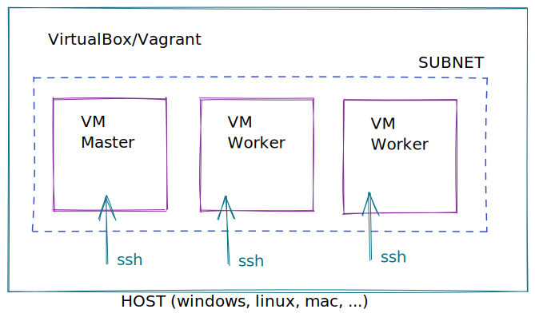

# TP1 installation de l'environnement de TP

Le but de ce TP est de monter un environnement K8S sur des machines virtuelles afin de réaliser la suite des TPs.

Containerd documentation : https://gitea.cncfstack.com/containerd/containerd/src/branch/main/docs/cri/config.md

## Prérequis

VirtualBox/Vagrant, connexion internet.

Se référer à la documentation d'installation de VirtuaBox et Vagrant.

* https://www.virtualbox.org/wiki/Downloads
* https://www.vagrantup.com/downloads

Tester le lancement d'une machine vagrant avant de commencer.

```bash
mkdir vagrant-test
cd vagrant-test
vagrant init debian/bookworm64
vagrant up
vagrant ssh
```

## Architecture cible

Nous allons metre en place cette architecture:



## Installation des machines virtuelles

Dans le dossier lab, ouvrir un terminal et lancer la création des 3 machines :

```bash
vagrant up
```

Pendant l'installation, ouvrir le fichier Vagrantfile avec un éditeur de texte, et lire les commandes de l'installation.

Une fois l'installation terminée, ouvrir un shell dans la VM "master"

```bash
vagrant ssh master
```

Une fois connecté, initialiser le cluster.

```bash
sudo kubeadm init --apiserver-cert-extra-sans my-k8s.local --pod-network-cidr=172.16.0.0/12 --apiserver-advertise-address 192.168.56.10
```

Si tout se passe bien, le noeud master est correctement initialisé.

Exemple de réponse:

```bash
Your Kubernetes control-plane has initialized successfully!

To start using your cluster, you need to run the following as a regular user:

  mkdir -p $HOME/.kube
  sudo cp -i /etc/kubernetes/admin.conf $HOME/.kube/config
  sudo chown $(id -u):$(id -g) $HOME/.kube/config

Alternatively, if you are the root user, you can run:

  export KUBECONFIG=/etc/kubernetes/admin.conf

You should now deploy a pod network to the cluster.
Run "kubectl apply -f [podnetwork].yaml" with one of the options listed at:
  https://kubernetes.io/docs/concepts/cluster-administration/addons/

Then you can join any number of worker nodes by running the following on each as root:

kubeadm join 192.168.56.10:6443 --token fyv2wr.ooobph9jd8x5hoj9 \
	--discovery-token-ca-cert-hash sha256:0ffe4e1b58f9ea80b2f39aa8a5cd3c0655117d09bf1697e376d43b24cf93a11d
```

Le retour de la commande nous demande de préparer quelques fichiers de config, et de déployer un POD de getsion du réseau.

```bash
mkdir -p $HOME/.kube
sudo cp -i /etc/kubernetes/admin.conf $HOME/.kube/config
sudo chown $(id -u):$(id -g) $HOME/.kube/config
```

Création du réseau (avec Calico)

```bash
kubectl apply -f https://docs.projectcalico.org/manifests/calico.yaml
```

## Ajout des deux workers

Ouvrir un nouveau terminal dans le dossier `lab`, et se connecter en ssh à la machine "worker1"

```bash
vagrant ssh worker1
```

Copier/coller la commande de "join" donée par la machine "master": (exemple)

```bash
sudo kubeadm join 192.168.56.10:6443 --token fyv2wr.ooobph9jd8x5hoj9 --discovery-token-ca-cert-hash sha256:0ffe4e1b58f9ea80b2f39aa8a5cd3c0655117d09bf1697e376d43b24cf93a11d
```

Exemple de réponse:


```bash
[preflight] Running pre-flight checks
[preflight] Reading configuration from the cluster...
[preflight] FYI: You can look at this config file with 'kubectl -n kube-system get cm kubeadm-config -o yaml'
W0124 10:54:12.853193    9820 utils.go:69] The recommended value for "resolvConf" in "KubeletConfiguration" is: /run/systemd/resolve/resolv.conf; the provided value is: /run/systemd/resolve/resolv.conf
[kubelet-start] Writing kubelet configuration to file "/var/lib/kubelet/config.yaml"
[kubelet-start] Writing kubelet environment file with flags to file "/var/lib/kubelet/kubeadm-flags.env"
[kubelet-start] Starting the kubelet
[kubelet-start] Waiting for the kubelet to perform the TLS Bootstrap...

This node has joined the cluster:
* Certificate signing request was sent to apiserver and a response was received.
* The Kubelet was informed of the new secure connection details.

Run 'kubectl get nodes' on the control-plane to see this node join the cluster.
```

Depuis le noeud master, vérifier que le worker 1 est bien ajouté.

```bash
vagrant@ubuntu-focal:~$ kubectl get nodes
NAME           STATUS   ROLES                  AGE     VERSION
master         Ready    control-plane,master   4m44s   v1.23.2
worker1        Ready    <none>
```

Répéter toutes ces opérations pour le worker2

Vérifier à nouveau que le cluster est bien formé depuis le master (kubectl get nodes)


Vérifier que tous les pods de calico sont initialisés :

```bash
watch kubectl get pods -A
```

## Commandes pour reset après un reboot/restart des machines

Sur le noeud master

```bash
kubeadm token create --print-join-command
```

Sur les workers

```bash
sudo kubeadm reset
sudo kubeadm join 192.168.56.10:6443 --token xk0ew2.pi59xvo1f7teq2sd --discovery-token-ca-cert-hash sha256:7f7c2d07aa6be0222b072f28aa82424adabe40240169d06b4c5a54a98c1b941d 
```
